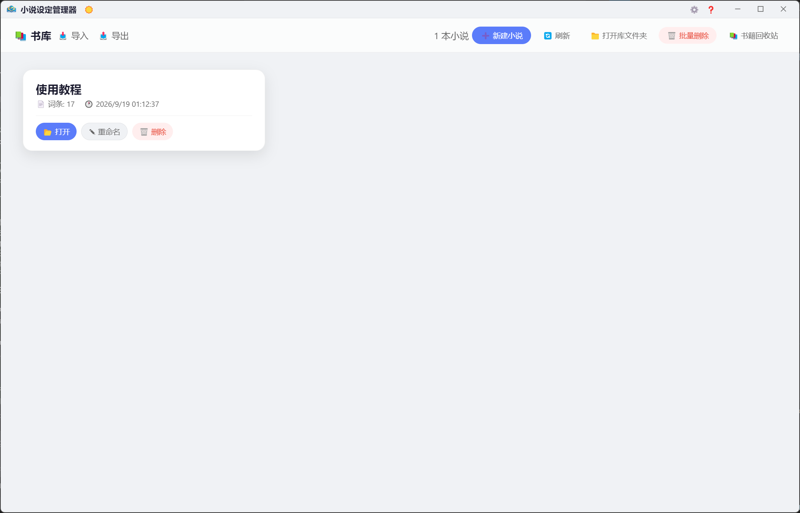
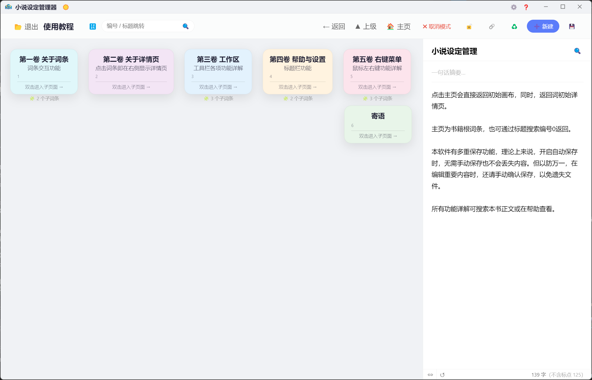
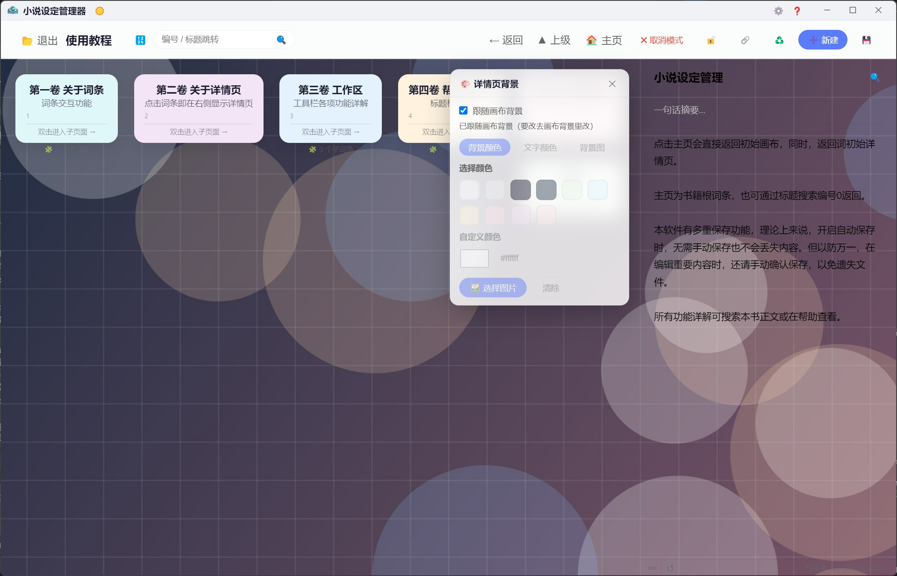
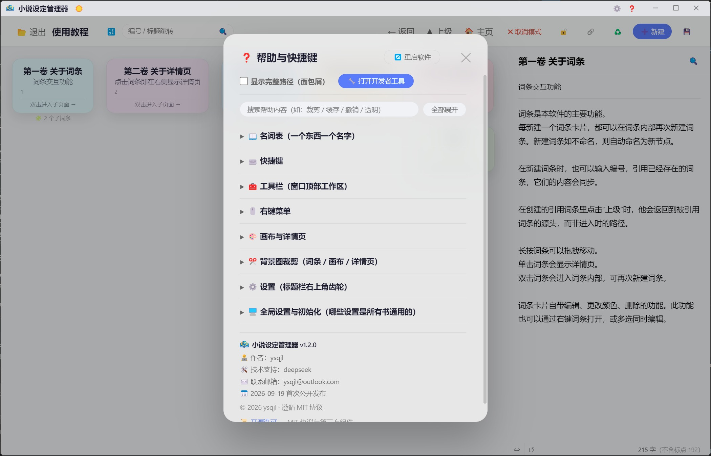

# 小说设定管理器

> 用「词条卡片 + 无限画布」整理小说设定的桌面工具。人物、地点、势力、时间线、伏笔……一个词条一张卡，卡与卡之间连线，点开就能写正文。

基于 **Electron** 开发，**Windows 桌面应用**，**完全离线**（不联网、不传数据），数据以 JSON 明文件存在本地。

**[⬇️ 下载最新版](https://github.com/Islilis/novel-setting-manager/releases/latest)**（安装包约 74 MB，双击安装即可）

---

## 目录

- [它解决什么问题](#它解决什么问题)
- [主要功能](#主要功能)
- [界面预览](#界面预览)
- [下载与安装](#下载与安装)
- [从源码运行](#从源码运行)
- [自己打包](#自己打包)
- [数据存在哪里（很重要）](#数据存在哪里很重要)
- [常用快捷键](#常用快捷键)
- [常见问题](#常见问题)
- [开发说明](#开发说明)
- [许可证](#许可证)
- [联系作者](#联系作者)

> 📖 为少占篇幅，「**常用快捷键 / 常见问题 / 从源码运行 / 自己打包 / 开发说明**」几节已折叠成一行 —— 点那行左边的 **▸** 展开即可；从上面目录点进去也会自动展开。

---

## 它解决什么问题

写长篇时，"设定"往往散在好几个文档、表格和脑中：

- 人物 A 的性格写在人物表里，他出场的伏笔写在正文里，关系写在另一张图上；
- 想不起来某个地名之前有没有用过、某个组织下设哪几个堂口；
- 写着写着忘了自己前面埋了什么。

这个工具的做法是：**一个设定 = 一张卡片（词条）**，卡片能放进画布、能嵌套子画布、能彼此连线，卡片里可以直接写正文。于是"查设定"和"写正文"在同一个界面里完成。

---

## 主要功能

### 词条与画布

- **词条卡片**：每张卡有「标题 / 摘要 / 正文」三块，卡片可自由拖动、改大小、换颜色。
- **子画布**：双击卡片进入它的内部画布，可以在里面继续新建词条（相当于"人物 → 他的招式"），用 `← 返回` 退出；卡片下方显示它有几个子词条。
- **连接线**：词条之间可拉线表示关系，也能一键清空本书所有连线。
- **引用词条**：某词条可以"引用"另一个词条，显示为引用的标题（或你填的**别名**，最多 20 字），源词条改名后引用处自动跟着变。
- **多选与批量**：框选或勾选多个词条，可批量编辑内容、批量重命名（如 `第{n}章`、或直接输入 `第五章` 自动递增）、批量换色、批量删除、排列选中。
- **排列与锁定**：按编号排列 / 按位置排列（不改变先后关系）；`锁定内部` / `锁定本页` 让该页不参与自动排列（卡片上显示 📌）。
- **撤销**：`Ctrl+Z` 可撤销换色、清除背景、重置样式、删除词条、初始化等操作。

### 详情页

- 点卡片看详情：**背景（可跟随画布背景）、文字颜色、页面宽度**都能调，宽度左边拖 `⇔` 调整、`↺` 一键复位，且会被记住。
- **字数统计**：详情页与编辑弹窗都显示字数（换行和空格不计入）。
- **正文 / 标题 / 摘要都能拖放移动文本**（v1.1 新增）：选中一段文字 → 按住左键拖到目标位置松手即可移动；按住 `Ctrl` 拖 = 复制。**支持跨块**（正文 ⇄ 标题 ⇄ 摘要）、**拖到上/下边缘会自动滚动**，松手后文字保持选中，`Ctrl+Z` 可撤销。从记事本 / 浏览器拖文字进来会按**纯文本**插入。
- **搜索**：正文搜索 + 命中高亮 + 一键跳到下一个。

### 背景与外观

- **画布背景 / 详情页背景**：图片（铺满 / 完整 / 拉伸）或纯色；详情页可勾选"跟随画布背景"，让两张背景**连成一整张**。
- **卡片底色透明**（v1.1 新增）：PNG 透明区域或"完整显示"时不再露出白边，直接透出画布背景；选图片背景自动打开、换纯色自动关闭。
- **深色模式**与**系统取色器**（支持 RGB / HEX / HSL 输入）。
- **开屏动画**：启动、打开项目、备份时显示（启动很快时自动不显示，不拖慢启动）。
- **内置帮助面板**：完整说明书就装在软件里，`Ctrl+F` 可搜索帮助内容。

### 数据安全

- **词条回收站**与**书籍回收站**：删掉的词条 / 整本书都能找回，也能选择彻底删除或清空。
- **备份**：一键备份当前书；每次重置前自动留档，**最多保留最近 10 次**，可「恢复上次重置」。
- **导入 / 导出**：拖入 `.txt` / `.md` 文件可导入成词条树；可导出 Markdown；每本书就是一个 `.json` 文件，方便自己拷贝和备份。

---

## 界面预览

| 书库页 | 画布与词条 |
|---|---|
|  |  |

| 详情页（演示：画布背景图 + 详情页跟随画布背景） | 内置帮助 |
|---|---|
|  |  |

---

## 下载与安装

到本仓库的 **[Releases](https://github.com/Islilis/novel-setting-manager/releases/latest)** 页面下载 `Setup x.y.z.exe`（GitHub 的附件名只能用英文字母 / 数字，所以文件名是英文的；装出来的软件名仍是「小说设定管理器」）：

1. 双击安装。安装向导里**可以改安装位置**（默认 `%LOCALAPPDATA%\Programs\小说设定管理器`）。
2. 首次启动会在**程序目录下**自动创建 `小说库` 文件夹，并把内置的「使用教程」复制进去 —— 照着点一遍就知道怎么用。
3. 打开软件后点右下角「帮助」，可以看到完整说明书。

> ⚠️ **卸载时会问你「是否保留小说库数据」**：选「是」保留你的书，选「否」会连数据一起删除。**卸载前建议先备份**（用软件里的备份按钮，或直接把 `小说库` 文件夹复制走）。
>
> 🔒 软件**不联网、不上传任何数据**，全部功能离线可用。

---

## 从源码运行

<details>
<summary>💻 点开查看：需要 Node.js 16+，clone 后 <code>npm install</code> / <code>npm start</code></summary>

需要 **Node.js 16 或更高**（建议 18 / 20 LTS）。

```bash
git clone <仓库地址>
cd <你 clone 下来的文件夹名>
npm install
npm start
```

> 💡 仓库里**不带任何书籍数据**（`.gitignore` 排除了 `小说库/`，避免把作者的书写内容传上去），但**带了一份内置教程** `小说库/使用教程.json` —— 它就是软件自带的说明书（安装包里那份也是它），所以源码首次运行就能在书库里点开「使用教程」，和你自己写的书互不干扰。

> ⚠️ **Windows PowerShell 上若报 `npm.ps1 ... 在此系统上禁止运行脚本`**，那是 PowerShell 的执行策略，不是项目问题。任选一种：
> - 改用 **CMD（命令提示符）** 执行 `npm install`；
> - 或把命令写成 `npm.cmd install`、`npm.cmd start`；
> - 或（一次性放开）在 PowerShell 里执行 `Set-ExecutionPolicy -Scope CurrentUser RemoteSigned`。

</details>

---

## 自己打包

<details>
<summary>📦 点开查看：<code>npm run build</code>、打包白名单与产物说明</summary>

```bash
npm run build      # 实际执行：set CSC_IDENTITY_AUTO_DISCOVERY=false && electron-builder
```

产物在 `dist/`：NSIS 安装包（`.exe`）以及免安装的 `win-unpacked/`。

打包**只会带上白名单里的文件**（见 `package.json` 的 `build.files`）：程序本体 + 图标 + 内置的 `小说库/使用教程.json`。
**你自己的书不会被装进去**（`小说库/` 在 `.gitignore` 里，也从不进安装包）。

> 💡 内置教程**自带的教学内容不带背景图**（发布前已清空，安装包更小更干净；教程里出现的「背景图片缓存」只是功能介绍，那个文件夹平时是空的）。
> 上面「界面预览」里的**详情页**那张是**功能演示**：示例中给**画布**设了背景图、详情页勾了「跟随画布背景」（截图右侧打开的正是「详情页背景」面板），所以预览里能看到花纹 —— 该演示图是**自制图案**（非任何第三方素材），和内置教程本身无关。
> 以后若想给教程配背景图：把图放进 `小说库/背景图片缓存/`、在教程里选上，再把 `小说库/背景图片缓存/**` 加回 `build.files` 白名单 —— 否则打包后的教程里那张图会看不到。

> 安装目录里会自动带上 `LICENSE.electron.txt` 与 `LICENSES.chromium.html`（Electron / Chromium 的许可证文本，由 electron-builder 自动放置）。

</details>

---

## 数据存在哪里（很重要）

**便携式设计：数据就放在程序旁边**，不写注册表、不往用户目录藏东西。

| 运行方式 | `小说库` 的位置 |
|---|---|
| 源码运行 | 项目目录下的 `小说库\`（即执行 `npm start` 时的工作目录） |
| 安装版 | **exe 同目录**：`%LOCALAPPDATA%\Programs\小说设定管理器\小说库\`（安装时若改过位置，就是那个位置） |

- 每本书 = 一个 `.json` 文件（例如 `我的小说.json`）。
- 换电脑：把整个 `小说库` 文件夹拷过去就行。
- 分享设定：直接发这个 `.json` 文件（或用软件里的导出）。

---

## 常用快捷键

<details>
<summary>⌨️ 点开查看快捷键表</summary>

| 操作 | 快捷键 |
|---|---|
| 复制 / 剪切 / 粘贴词条 | `Ctrl+C` / `Ctrl+X` / `Ctrl+V` |
| 撤销（换色、删除、重置、初始化…都能撤） | `Ctrl+Z` |
| 取消剪切 / 取消选色 | `Esc` |
| 界面搜索、帮助面板内搜索 | `Ctrl+F` |
| 拖放移动文字时改为复制 | 按住 `Ctrl`（或 `Alt`）拖动 |
| 框选多个词条 | 在画布空白处长按拖动（左键 / 右键都可以） |
| 进入 / 退出子画布 | 双击卡片 / 点 `← 返回` |

</details>

---

## 常见问题

<details>
<summary>❓ 点开查看：启动闪屏 / SmartScreen 拦截 / 卸载会不会删书 / 数据能不能换位置 / 有没有 macOS 版 / 怎么协作同步 / 能导入文档吗</summary>

**Q：启动时界面会闪一下白色 / 很浅的灰？**
不是白屏。窗口在出现前会先铺一层**当前主题的底色**，浅色主题下这个色是 `#f0f2f5`（非常接近白的浅灰）。实测从第一帧起就没有纯白画面，属于正常现象；深色主题下则是深色的。

**Q：Windows 提示"未知发布者" / SmartScreen 拦我？**
因为没有购买代码签名证书。点「更多信息」→「仍要运行」即可。软件不联网，可以放心。

**Q：卸载会不会把我的书删掉？**
卸载程序会**主动问**你"是否保留小说库数据"。选「是」就保留。不过还是建议**养成备份习惯**：软件里有备份按钮，或者定期把 `小说库` 文件夹复制一份到别处。

**Q：能把数据放到别的地方吗（比如网盘）？**
目前是便携式设计：数据固定在"可执行文件同目录的 `小说库`"。想搬走就**整个文件夹一起移动**；想同步就把 `小说库` 放进网盘同步目录，或直接同步某个 `.json` 文件。

**Q：有 macOS / Linux 版吗？**
目前只提供 Windows 版（打包目标只有 NSIS）。

**Q：能多人协作 / 云同步吗？**
没有账号系统、不联网。协作方式是**传递 `.json` 文件**（或用导出功能交换内容）。

**Q：能导入现成的设定文档吗？**
把 `.txt` 或 `.md` 文件**直接拖进窗口**，会按标题层级导入成词条树。

**Q：帮助文档在哪？**
就装在软件里：打开软件 → 点「帮助」按钮，里面有分类说明书，并支持 `Ctrl+F` 搜索。

</details>

---

## 开发说明

<details>
<summary>🛠️ 点开查看：技术栈、文件结构、安全设置、打包注意事项</summary>

- **技术栈**：Electron 28 + 原生 HTML / CSS / JavaScript（无前端框架、无打包器）
- **运行时依赖**：无（`dependencies` 为空；只用了 `electron` 与 `electron-builder` 两个开发依赖）
- **文件结构**：

  | 文件 | 作用 |
  |---|---|
  | `main.js` | 主进程：窗口创建、IPC、文件读写、备份、临时文件清理 |
  | `preload.js` | 安全桥接（`contextIsolation: true` + `nodeIntegration: false`） |
  | `renderer.js` | 全部界面逻辑（画布、词条、详情页、搜索、拖放…） |
  | `index.html` / `style.css` | 界面结构与样式（含内置帮助文档） |
  | `installer.nsh` | 安装 / 卸载的自定义行为（安装目录、卸载询问） |
  | `小说库/` | **本地数据目录**：书籍数据被 `.gitignore` 排除、不进仓库（**唯一例外**是内置教程 `小说库/使用教程.json`，它同时也是安装包里的那份，别人装完就有教程看）；教程不再带背景图 |

- **安全设置**：渲染进程不直接触碰 Node，所有文件操作都通过 `preload.js` 暴露的有限接口完成。
- **提交代码前请确认**：`小说库/` 与 `问题汇总.txt` 已被 `.gitignore` 排除。
- **建议把项目放在纯英文路径下**（如 `D:\NSM\app`）：`npm install` 与打包工具遇到含中文或空格的路径偶尔会出毛病（`小说库` 这个数据文件夹名本身不受影响）。

</details>

---

## 许可证

- **本项目**：MIT License，见 [LICENSE](LICENSE)。版权归 **ysqjl** 所有。
  你可以自由使用、修改、分发（包括商用），只需在副本中保留版权声明与许可证文本。
- **第三方**：本软件基于 **Electron**（MIT）与 **Chromium**（BSD-3-Clause 等）构建。
  完整说明见 [THIRD-PARTY-NOTICES.md](THIRD-PARTY-NOTICES.md)；安装目录中也随包附带 `LICENSE.electron.txt` 与 `LICENSES.chromium.html`。

---

## 联系作者

- 邮箱：**ysqjl@outlook.com**
- 问题反馈：欢迎提 [Issue](https://github.com/Islilis/novel-setting-manager/issues)（贴上报错文字或截图，说明怎么复现）
